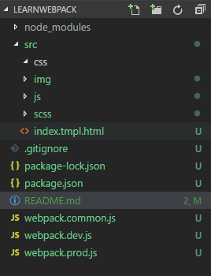

# learnwebpack
项目中webpack配置
## 介绍
这两天，对webpack的基本配置进行了梳理，与之前相比，将webpack的开发环境和生产环境分开，分别创建`webpack.dev.js`和`webpack.prod.js`，将公共部分进行抽离，创建`webpack.common.js`，使用`webpack-merge`进行合并。  

* 开发环境，使用`webpack-dev-server` 创建了本地服务器，并结合热加载实现代码更改时页面自动刷新，并设置针对css、scss、img、js的loader，使得相应文件能够正常正常引入、编译、转换、输出
* 生产环境，使用`miniCssExtractPlugin`将css与js进行分离

## 使用
项目目录：

  
1. 在src目录下编写相应的css、js、scss或引入图片
2. 在`Git Bash`中输入：  
* 开发环境：`npm start`，自动打开浏览器，预览页面  
* 生产环境：：`npm run build`，生产相应的dist文件，其中包含编译后的文件